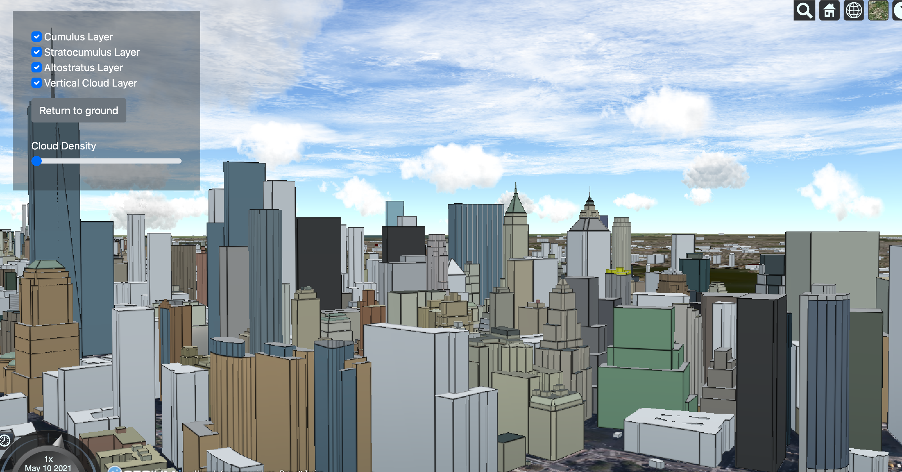

# billboard-clouds-in-cesium
DMD S2021 Senior Design project.

1. Clone the project
2. `npm install` to install node packages
3. Install [Live Server](https://github.com/ritwickdey/vscode-live-server) extension for VSCode.
4. Right-click on the index.html file and select "Open with live server". Alternatively, click on "Go Live" either at the top right corner or bottom right corner of the VSCode window. This should open index.html in the browser.

